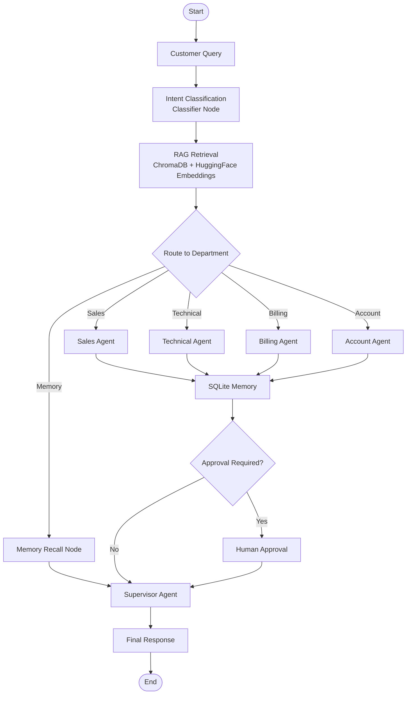

# 🤖 AI-Powered Customer Support Automation System using LangGraph

An AI-powered Customer Support Automation System built using **LangGraph**, **LangChain**, **ChromaDB**, **SQLite**, and **Ollama**.

This project automates customer support by intelligently classifying customer queries, retrieving relevant information from company documents using Retrieval-Augmented Generation (RAG), routing requests to specialized support agents, maintaining conversation history with SQLite memory, handling high-risk requests through Human-in-the-Loop approval, and improving responses using a Supervisor Agent.

This project was developed as part of the **IBM Agentic AI Assignment**.

---

# 📌 Project Objectives

ABC Technologies receives thousands of customer support requests every day regarding:

- Product Information
- Pricing Plans
- Technical Issues
- Billing Queries
- Account Management
- Refund Requests

Manual handling increases response time and operational cost.

This system automates the entire support workflow using an Agentic AI architecture built with LangGraph.

---

# 🚀 Features

- Intent Classification
- Multi-Agent Architecture
- LangGraph Workflow
- Retrieval-Augmented Generation (RAG)
- Chroma Vector Database
- SQLite Memory
- Human-in-the-Loop Approval
- Supervisor Agent
- Rich Terminal Interface
- Local LLM using Ollama

---

# 🏗️ System Architecture

The workflow follows the architecture below:

```
Customer Query
       │
       ▼
Intent Classification
       │
       ▼
Retrieve Relevant Documents (RAG)
       │
       ▼
Route to Appropriate Agent
       │
       ▼
Support Agent
       │
       ▼
SQLite Memory
       │
       ▼
Approval Check
       │
       ├───────────────┐
       │               │
       ▼               ▼
Human Approval     Supervisor
       │               │
       └──────► Final Response
```
# 🔄 LangGraph Workflow


---

# 🤖 Multi-Agent Architecture

The system contains four specialized support agents.

| Agent | Responsibility |
|--------|----------------|
| Sales Agent | Pricing, Plans, Product Information |
| Technical Agent | Software Errors, Login Issues, Troubleshooting |
| Billing Agent | Refunds, Payments, Invoices |
| Account Agent | Password Reset, Profile Updates, Account Management |

---

# 📂 Knowledge Base Documents

The RAG pipeline retrieves information from the following company documents.

```
Documents/

company_policy.txt

pricing_guide.txt

technical_manual.txt

faq.txt
```

These documents are converted into embeddings and stored inside ChromaDB.

---

# 🧠 Memory

Conversation history is stored using SQLite.

Database:

```
Database/memory.db
```

The system remembers previous conversations.

Example:

Customer:

```
My name is David.
```

Later:

```
What is my name?
```

Response:

```
Your name is David.
```

---

# ⚠ Human-in-the-Loop

The following requests require manual approval.

- Refund Requests
- Subscription Cancellation
- Account Closure
- Compensation Requests
- Escalation to Management

The approval process simulates a human supervisor.

---

# 🧑‍💼 Supervisor Agent

The Supervisor Agent reviews every generated response and improves:

- Professionalism
- Clarity
- Grammar
- Customer Tone

before returning the final answer.

---

# 📁 Project Structure

```
Assignment2/

│
├── Database/
│   ├── chroma_db/
│   └── memory.db
│
├── Documents/
│   ├── company_policy.txt
│   ├── pricing_guide.txt
│   ├── technical_manual.txt
│   └── faq.txt
│
├── Screenshots/
│
├── Workflow/
│
├── app.py
├── graph.py
├── state.py
├── classifier.py
├── agents.py
├── rag.py
├── memory.py
├── approval.py
├── supervisor.py
├── llm.py
├── requirements.txt
└── README.md
```

---

# 🛠 Technologies Used

- Python 3.11
- LangGraph
- LangChain
- Ollama
- ChromaDB
- HuggingFace Embeddings
- SQLite
- Rich

---

# 📦 Python Packages

```
langgraph==1.2.6

langchain==1.3.11

langchain-community==0.4.2

langchain-chroma

langchain-huggingface

langchain-ollama==1.1.0

chromadb==1.5.9

sentence-transformers==5.1.0

torch

rich
```

---

# ⚙ Installation

## Clone Repository

```bash
git clone <repository-url>

cd Assignment2
```

---

## Create Virtual Environment

Windows

```bash
python -m venv env
```

Activate

```bash
env\Scripts\activate
```

---

## Install Dependencies

```bash
pip install -r requirements.txt
```

---

## Pull Ollama Model

```bash
ollama pull qwen2.5:3b
```

---

## Start Ollama

```bash
ollama serve
```

---

# ▶ Running the Project

Run

```bash
python app.py
```

---

# 💬 Sample Demonstration Queries

### Sales

```
What are the pricing plans available for your software?
```

---

### Account

```
I forgot my account password.
```

---

### Technical

```
My application crashes whenever I upload a file.
```

---

### Billing

```
I need a refund for my annual subscription.
```

---

### Memory

```
What was my previous support issue?
```

---

# 📸 Output

The system demonstrates:

- Intent Classification
- Conditional Routing
- Multi-Agent Collaboration
- RAG Retrieval
- SQLite Memory
- Human Approval
- Supervisor Validation

using a Rich-based terminal interface.

---

# 📈 Future Improvements

- User Authentication
- Multi-user Memory
- Voice Support
- Email Integration
- Ticket Generation
- Dashboard Analytics
- REST API Deployment

---

# 👨‍💻 Author

**Manoj Sanagapalli**

AI & Machine Learning Student

VIT-AP University

IBM Agentic AI Assignment

---

# 📄 License

This project is developed for educational purposes as part of the IBM Agentic AI Assignment.
